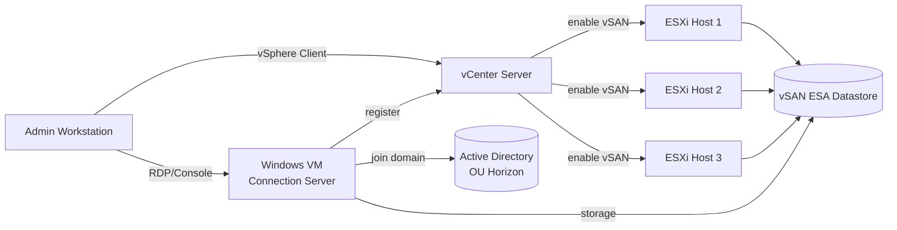

# Horizon Connection Server (Standalone)
- Connection Server là broker chính của VMware Horizon, chịu trách nhiệm authenticate user, quản lý entitlement, và điều phối kết nối tới desktop VM. Xem lý thuyết đầy đủ tại [[horizon--connection-server]]
- Trong hệ thống VDI tổng thể ([[VDI]]), đây là component bắt buộc phải có trước tiên, trước khi có thể tạo Desktop Pool hay kết nối Unified Access Gateway ở các lab sau
- Lab này gồm cả phần chuẩn bị nền tảng (vSAN storage, Active Directory) lẫn phần cài đặt Connection Server, vì cả hai đều là điều kiện bắt buộc để Connection Server hoạt động đúng

# Prerequisites
- Tối thiểu 3 ESXi host đã cài đặt, join vào cùng 1 Cluster trong vCenter, chưa cần bật vSAN
- Mỗi ESXi host có ít nhất 1 NVMe/flash disk còn trống, chưa claim, dùng riêng cho vSAN ESA
- Physical network và VLAN cho vSAN traffic đã kéo cáp và cấu hình switch sẵn giữa các host, vSAN dùng network riêng không chung với network quản lý hay client, xem thêm [[vdi--networking-firewall-ports]]
- Domain Controller (Active Directory Domain Services) đã cài đặt và hoạt động, là DC gốc của forest/domain, chưa có OU hay service account riêng cho Horizon
- DNS Server và DHCP (nếu dùng) đã hoạt động trong domain hiện tại
- License Horizon hợp lệ, xem thêm mô hình license tại [[vdi--capacity-planning-licensing]]
- File cài đặt Horizon Connection Server đã copy sẵn vào máy Admin Workstation hoặc share nội bộ, không cần Internet vì môi trường airgap
- Máy Admin Workstation có quyền truy cập vCenter, Domain Controller, và mạng quản lý để thao tác các bước bên dưới

# Diagram

---
# Installation

### Cấu hình vSAN Cluster làm storage backend

- Đăng nhập vCenter Server bằng vSphere Client, chọn đúng Cluster đã chứa các ESXi host cần dùng
- Vào tab Configure của Cluster, chọn mục vSAN > Services, click Configure
- Chọn Single site cluster, bỏ qua Stretched Cluster và 2-Node vì quy mô lab nhỏ
- Chọn kiến trúc Express Storage Architecture (ESA), lưu ý toàn bộ host tham gia phải có disk certified cho ESA
- Ở bước Claim disks, chọn đúng NVMe disk còn trống trên từng host để đưa vào vSAN storage pool, kiểm tra kỹ để không chọn nhầm disk đang chứa OS của ESXi
- Review lại toàn bộ cấu hình network, disk đã claim, rồi click Finish để vSAN bắt đầu format và khởi tạo storage pool
- Sau khi khởi tạo xong, vào vSAN > Skyline Health, chạy full health check và xác nhận toàn bộ mục network, physical disk, cluster đều ở trạng thái xanh
- Tạo mới 1 VM Storage Policy, đặt tên rõ ràng ví dụ vSAN-VDI-Policy, cấu hình Site disk tolerance là RAID-1 Mirroring để tối ưu performance cho desktop workload
- Gán VM Storage Policy vừa tạo làm default cho Datastore vSAN nếu cluster chỉ phục vụ riêng cho VDI, hoặc gán thủ công khi tạo VM Connection Server ở bước sau

### Cấu hình Active Directory cho Horizon

- Đăng nhập Domain Controller bằng tài khoản Domain Admin
- Mở Active Directory Users and Computers, tạo mới 1 Organizational Unit tên Horizon ngay dưới domain root, dùng để chứa computer object của Connection Server và desktop VM sau này
- Tạo 1 Organizational Unit con bên trong OU Horizon, đặt tên Service Accounts, dùng để chứa các tài khoản dịch vụ riêng cho Horizon
- Tạo mới 1 user account trong OU Service Accounts, đặt tên ví dụ svc-horizon, bỏ chọn User must change password at next logon, chọn Password never expires theo policy nội bộ về service account
- Chuột phải vào OU Horizon, chọn Delegate Control, add tài khoản svc-horizon, cấp quyền Create, delete, and manage user accounts và Join a computer to the domain, giới hạn phạm vi chỉ trong OU Horizon
- Tạo 1 Security Group loại Global, đặt tên ví dụ VDI-Users, dùng để entitlement user vào Desktop Pool ở lab sau
- Trên DNS Server, tạo 1 Host (A) record trỏ FQDN dự kiến của Connection Server sang địa chỉ IP tĩnh sẽ gán cho VM, đồng thời tạo Pointer (PTR) record tương ứng trong reverse lookup zone
- Chạy lệnh nslookup theo cả hai chiều forward và reverse từ Admin Workstation để xác nhận DNS record đã đúng
- Trên Domain Controller, kiểm tra Windows Time Service đang chạy đúng vai trò NTP source cho domain bằng lệnh w32tm /query /status, đảm bảo toàn bộ máy trong domain đồng bộ giờ từ đây

### Chuẩn bị VM Windows Server cho Connection Server

- Trong vCenter, tạo mới VM từ ISO Windows Server hoặc từ template có sẵn, đặt tên theo chuẩn nội bộ, ví dụ vdi-cs01
- Gán resource theo sizing tối thiểu cho pool nhỏ dưới 50 desktop, 4 vCPU, 16GB RAM, disk từ 80GB trở lên
- Ở bước chọn storage khi tạo VM, chọn Datastore vSAN vừa tạo và áp dụng VM Storage Policy vSAN-VDI-Policy
- Cài đặt Windows Server, đặt computer name trùng khớp với FQDN đã tạo DNS record ở bước trước
- Cấu hình network adapter với địa chỉ IP tĩnh, subnet mask, default gateway, và trỏ DNS server về Domain Controller
- Join VM vào domain, chọn đúng Organizational Unit là OU Horizon, dùng tài khoản svc-horizon nếu đã delegate quyền join computer, hoặc dùng Domain Admin nếu chưa delegate
- Restart VM sau khi join domain, login lại bằng tài khoản domain có quyền local admin để xác nhận join thành công
- Cài đặt Windows Update cần thiết từ internal WSUS hoặc offline update package, vì môi trường airgap không có đường Internet trực tiếp
- Rà soát Windows Firewall local, mở đúng port Horizon Connection Server cần dùng theo [[vdi--networking-firewall-ports]], không tắt firewall hoàn toàn

### Cài đặt Horizon Connection Server

- Copy installer Horizon Connection Server (file .exe) vào VM qua share nội bộ hoặc removable media đã quét virus trước
- Chạy installer với quyền local Administrator
- Ở màn hình License Agreement, đồng ý điều khoản để tiếp tục
- Ở màn hình Destination Folder, giữ nguyên đường dẫn cài đặt mặc định trừ khi có yêu cầu riêng về phân vùng ổ đĩa
- Ở màn hình Installation Options, chọn Horizon Standard Server, không chọn Replica Server vì đây là Connection Server đầu tiên của group
- Ở màn hình Data Recovery, nhập password cho tài khoản recovery, dùng để backup/restore cấu hình Horizon sau này, lưu password này vào nơi lưu trữ an toàn ngoài VM
- Ở màn hình Firewall Configuration, giữ nguyên tùy chọn để installer tự động mở port cần thiết trên Windows Firewall local
- Ở màn hình Authorize current user, giữ nguyên tài khoản domain admin hiện tại làm Horizon Administrator đầu tiên
- Click Install, đợi quá trình cài đặt hoàn tất, không tắt VM hay ngắt kết nối trong lúc cài
- Khởi động lại VM nếu installer yêu cầu sau khi cài xong

### Cấu hình Horizon sau khi cài đặt

- Từ Admin Workstation, mở trình duyệt, truy cập địa chỉ https://<FQDN-connection-server>
- Đăng nhập Horizon Console bằng tài khoản domain admin đã được authorize lúc cài đặt
- Vào Settings > Product Licensing and Usage, nhập license key hoặc license file Horizon, click Add license
- Vào Settings > Servers > vCenter Servers, click Add, nhập FQDN của vCenter Server, tài khoản service account có quyền tương tác với vCenter, và xác nhận SSL certificate
- Sau khi add vCenter thành công, vào Monitor > Dashboard, kiểm tra widget System Health, xác nhận Connection Server và vCenter Server đều hiển thị trạng thái OK
- Vào Settings > Domains, xác nhận domain hiện tại đã được Horizon nhận diện đúng thông qua Active Directory
- Đăng xuất và đăng nhập lại Horizon Console một lần nữa để xác nhận không phát sinh lỗi session hay Kerberos

Lab này dừng lại ở việc có vSAN storage backend hoạt động, Active Directory đã sẵn sàng cho Horizon, và một Connection Server standalone đã kết nối được vCenter, chưa tạo Desktop Pool. Lab tiếp theo sẽ dùng golden image chuẩn bị sẵn để tạo Desktop Pool đầu tiên bằng Instant Clone, tham khảo lý thuyết tại [[horizon--desktop-pool-provisioning]]
