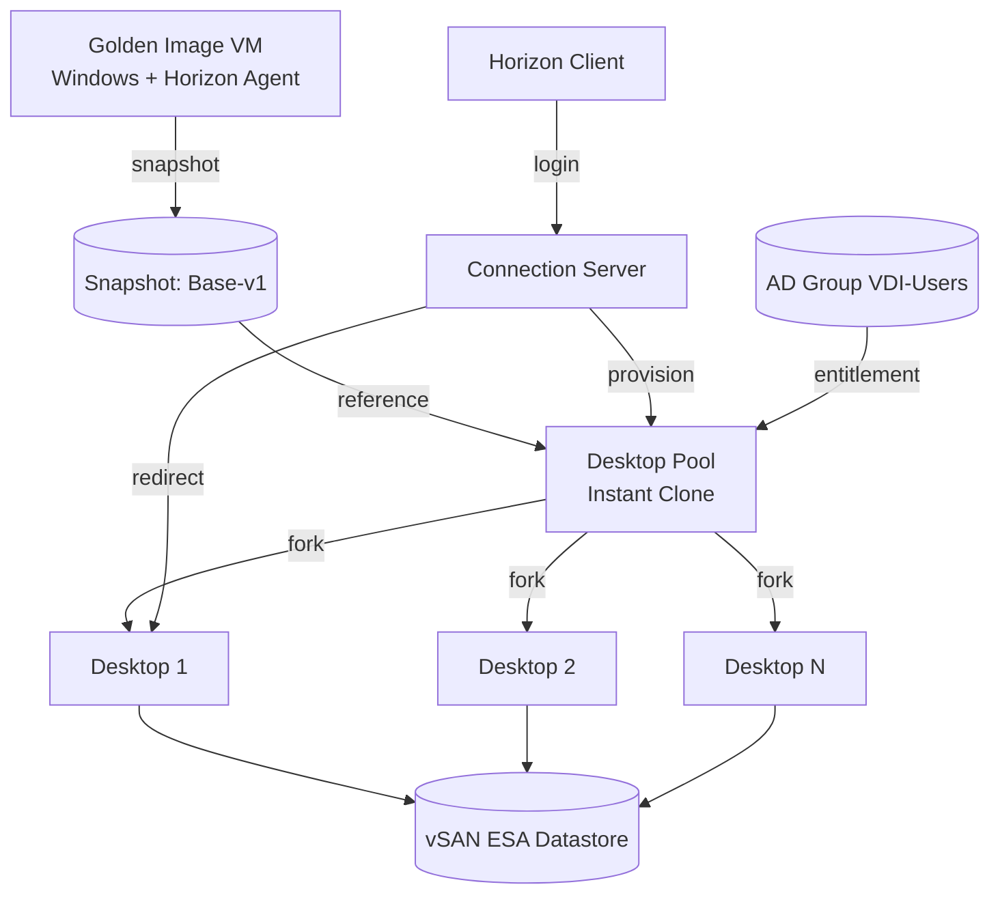

# Horizon Desktop Pool — Golden Image & Instant Clone
- Desktop Pool là tập hợp desktop VM được cấp phát tự động từ 1 golden image dùng chung, cho phép user tự nhận 1 desktop khi login thay vì admin gán tay từng máy. Xem lý thuyết đầy đủ tại [[horizon--desktop-pool-provisioning]]
- Lab này nối tiếp Lab 1, dùng Connection Server đã cài đặt và vSAN/Active Directory đã cấu hình để tạo Desktop Pool đầu tiên bằng cơ chế Instant Clone
- Kết thúc lab, user trong nhóm VDI-Users sẽ đăng nhập được vào một desktop VM thật thông qua Horizon Client, xác nhận toàn bộ chuỗi kết nối từ Connection Server tới desktop hoạt động đúng

# Prerequisites
- Connection Server từ Lab 1 đã cài đặt, kết nối vCenter thành công, Dashboard không còn warning
- vSAN datastore và VM Storage Policy vSAN-VDI-Policy từ Lab 1 đã sẵn sàng
- OU Horizon, Security Group VDI-Users, service account svc-horizon từ Lab 1 đã tạo sẵn trong Active Directory
- ISO cài đặt Windows client (Windows 10/11 Enterprise hoặc phiên bản được Horizon 8 hỗ trợ) đã có sẵn trong datastore hoặc content library, không cần Internet
- Installer Horizon Agent, đúng version tương thích với Connection Server đã cài, đã copy sẵn vào Admin Workstation hoặc share nội bộ
- VMware OS Optimization Tool bản offline đã chuẩn bị sẵn nếu muốn tối ưu golden image
- Network port group riêng cho desktop VM (VLAN compute) đã tạo sẵn trên vSwitch/Distributed Switch, tách biệt với network quản lý, xem thêm [[vdi--networking-firewall-ports]]
- Ít nhất một user test đã có trong Active Directory và đã được add vào group VDI-Users để entitlement thử nghiệm
- Horizon Client đã cài trên máy test, hoặc dùng HTML Access qua trình duyệt, để verify kết nối ở cuối lab

# Diagram

---
# Installation

### Tạo VM nền cho golden image

- Trong vCenter, tạo mới VM, đặt tên rõ ràng theo chuẩn golden image, ví dụ gi-win11-base
- Chọn Datastore vSAN và áp dụng VM Storage Policy vSAN-VDI-Policy đã tạo ở Lab 1
- Gán resource theo đúng profile desktop dự kiến, tham khảo [[vdi--capacity-planning-licensing]] để chọn vCPU/RAM phù hợp loại user (task worker/knowledge worker/power user)
- Gắn network adapter vào port group dành riêng cho desktop VM, không dùng chung port group với Connection Server
- Mount ISO Windows client, cài đặt hệ điều hành theo hướng dẫn chuẩn, đặt computer name tạm dùng riêng cho golden image
- Cài VMware Tools sau khi Windows cài xong, restart VM khi được yêu cầu

### Cấu hình Windows cơ bản trên golden image

- Join VM vào domain, đặt vào OU Horizon hoặc một OU con riêng cho golden image nếu muốn tách biệt quản lý
- Cập nhật Windows Update từ nguồn offline hoặc WSUS nội bộ, đảm bảo golden image đã patch đầy đủ trước khi nhân bản
- Cài đặt các ứng dụng chuẩn cần có sẵn cho toàn bộ user như trình duyệt, bộ office, công cụ nội bộ
- Tắt các dịch vụ Windows không cần thiết cho môi trường VDI, ví dụ Windows Search indexing, Hibernation, Superfetch
- Cấu hình Windows Firewall và policy bảo mật cơ bản theo chuẩn hardening nội bộ

### Cài đặt và cấu hình Horizon Agent

- Copy installer Horizon Agent vào golden image VM
- Chạy installer với quyền local Administrator
- Ở màn hình chọn feature, giữ nguyên các feature mặc định bao gồm hỗ trợ Instant Clone, chỉ bật thêm feature khác như USB Redirection nếu lab cần test riêng
- Hoàn tất cài đặt Horizon Agent, restart VM khi được yêu cầu
- Sau khi restart, kiểm tra service VMware Horizon Agent đang chạy trong Services.msc

### Tối ưu hóa golden image

- Chạy VMware OS Optimization Tool trên golden image
- Chọn template tối ưu phù hợp với phiên bản Windows đang dùng
- Review danh sách tweak được đề xuất như tắt animation, tắt service không cần, tinh chỉnh policy trước khi Apply, không áp dụng toàn bộ một cách mù quáng nếu có ứng dụng nội bộ phụ thuộc vào service nào đó
- Apply các tweak đã chọn, restart VM để tweak có hiệu lực
- Dọn dẹp golden image lần cuối, xóa cache, temp file, log cài đặt trước khi tạo snapshot

### Tạo snapshot cho golden image

- Shutdown VM golden image đúng cách, không power off đột ngột, để đảm bảo Instant Clone fork ở trạng thái sạch
- Trong vCenter, tạo Snapshot mới cho VM, đặt tên rõ ràng có version, ví dụ Base-v1, ghi chú ngày tạo và nội dung đã thay đổi
- Không xóa snapshot cũ nếu đang có Desktop Pool tham chiếu tới, chỉ dọn sau khi đã recompose pool sang snapshot mới

### Tạo Desktop Pool bằng Instant Clone

- Trong Horizon Console, vào Inventory > Desktops > Desktop Pools, click Add
- Chọn loại pool Automated Desktop Pool, provisioning type Instant Clone
- Chọn user assignment phù hợp mục tiêu lab, Floating nếu muốn desktop dùng chung không giữ state, hoặc Dedicated nếu muốn user cố định một desktop, tham khảo [[horizon--desktop-pool-provisioning]] để chọn đúng mô hình
- Đặt tên pool rõ ràng, ví dụ pool-test-01, nhập ID và display name để user thấy trong Horizon Client
- Ở bước chọn vCenter Server, chọn đúng golden image VM và snapshot Base-v1 vừa tạo
- Chọn Datastore vSAN và VM Storage Policy vSAN-VDI-Policy cho các Instant Clone sẽ được tạo ra
- Chọn OU trong Active Directory nơi các máy Instant Clone sẽ được join vào, dùng chung OU Horizon hoặc tạo OU con riêng cho desktop VM
- Nhập số lượng desktop tối thiểu/tối đa cho pool, chọn số lượng nhỏ cho lab, ví dụ 2 đến 3 desktop để dễ quan sát
- Review lại toàn bộ cấu hình rồi click Finish, Horizon sẽ tự động tạo internal parent VM và bắt đầu fork các Instant Clone

### Entitlement và kiểm tra pool

- Sau khi pool tạo xong, vào tab Entitlements của pool, add Security Group VDI-Users đã tạo ở Lab 1 vào danh sách được phép truy cập
- Vào Monitor > Dashboard hoặc trực tiếp Desktop Pools, theo dõi trạng thái các Instant Clone chuyển từ Provisioning sang Available
- Nếu có clone bị lỗi hoặc kẹt ở trạng thái Error, kiểm tra log trên Connection Server và trạng thái task trong vCenter để xác định nguyên nhân trước khi retry

### Kiểm tra kết nối bằng Horizon Client

- Từ máy test đã cài Horizon Client, nhập FQDN của Connection Server để kết nối
- Đăng nhập bằng tài khoản user test đã add vào group VDI-Users
- Xác nhận pool-test-01 hiển thị và có thể click vào để nhận một desktop
- Kết nối vào desktop, xác nhận màn hình hiển thị đúng, thao tác chuột/bàn phím mượt, không bị lag đáng kể, xem thêm về protocol tại [[horizon--display-protocol]]
- Logoff khỏi desktop, quay lại Horizon Console kiểm tra trạng thái desktop trở về Available nếu là floating pool, hoặc vẫn giữ nguyên cho user đó nếu là dedicated pool

Lab này hoàn tất việc có một Desktop Pool hoạt động bằng Instant Clone, user thật đã login và sử dụng được desktop. Lab tiếp theo sẽ triển khai Unified Access Gateway để cho phép truy cập pool này từ ngoài mạng nội bộ, tham khảo lý thuyết tại [[horizon--unified-access-gateway]]
