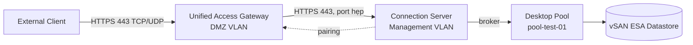

# Unified Access Gateway (UAG)
- UAG là appliance đứng ở DMZ, đóng vai trò reverse-proxy cho user truy cập desktop pool từ bên ngoài mạng nội bộ mà không cần VPN client. Xem lý thuyết đầy đủ tại [[horizon--unified-access-gateway]]
- Lab này nối tiếp Lab 2, dùng Desktop Pool pool-test-01 đã hoạt động để expose ra ngoài thông qua UAG
- Kết thúc lab, user từ ngoài mạng nội bộ sẽ kết nối được vào desktop pool qua FQDN external của UAG, xác nhận traffic đi đúng path Internet/External → DMZ → Management → Compute

# Prerequisites
- Lab 1 và Lab 2 đã hoàn thành, Connection Server hoạt động và Desktop Pool pool-test-01 có desktop ở trạng thái Available
- DMZ VLAN đã tạo sẵn trên network, tách biệt khỏi Management VLAN và Compute VLAN, có route ra external network và route hạn chế vào Management, xem thêm [[vdi--networking-firewall-ports]]
- File OVA của Unified Access Gateway đã tải sẵn offline, đúng version tương thích với Connection Server đang chạy
- Certificate SSL hợp lệ cho FQDN external của UAG, không dùng self-signed cho production, lab có thể tạm dùng certificate từ CA nội bộ nếu môi trường test airgap
- FQDN hoặc DNS record giả lập external đã trỏ đến địa chỉ IP sẽ gán cho UAG
- Tài khoản có quyền Deploy OVF Template trên vCenter
- Admin Workstation có thể truy cập network DMZ để cấu hình UAG qua Admin UI trên port 9443

# Diagram

---
# Installation

### Chuẩn bị network DMZ cho UAG

- Xác nhận VLAN DMZ đã có sẵn trên vSwitch hoặc Distributed Switch, tạo port group riêng dành cho UAG
- Xác nhận rule firewall cho phép traffic từ external network vào UAG đúng port cần thiết, và từ UAG vào Connection Server đúng port hẹp, không mở rộng ngoài phạm vi cần
- Nếu deploy UAG theo mô hình dual-NIC, chuẩn bị sẵn hai port group riêng biệt, một hướng ra external, một hướng vào Management, không dùng chung port group cho cả hai hướng

### Chuẩn bị certificate cho UAG

- Chuẩn bị file certificate bao gồm private key, đúng FQDN external đã đăng ký DNS, định dạng .pfx hoặc PEM tùy yêu cầu import của UAG
- Nếu dùng CA nội bộ do môi trường airgap không có CA public, xuất chứng chỉ CA root để import vào máy client test nhằm thiết lập trust chain
- Kiểm tra certificate còn hạn và đúng Subject Alternative Name khớp với FQDN sẽ dùng để truy cập UAG

### Deploy UAG OVA

- Trong vCenter, chọn Deploy OVF Template, trỏ tới file OVA của UAG đã chuẩn bị sẵn
- Chọn tên VM, resource pool, và thư mục lưu trữ phù hợp quy ước đặt tên nội bộ
- Chọn Datastore vSAN, có thể áp dụng Storage Policy riêng ít khắt khe hơn policy dành cho desktop VM vì UAG không có yêu cầu IOPS cao như Instant Clone
- Ở bước network mapping, gán đúng port group DMZ cho interface hướng ra external, và port group Management cho interface hướng vào trong nếu deploy dual-NIC
- Nhập thông số qua OVA properties gồm địa chỉ IP tĩnh, admin password, root password, tạm thời cho phép SSH nếu cần debug ở bước đầu rồi tắt lại sau khi ổn định
- Power on VM UAG sau khi deploy xong, đợi appliance khởi động hoàn tất

### Cấu hình UAG qua Admin UI

- Truy cập Admin UI của UAG qua địa chỉ https://<UAG-IP>:9443/admin
- Đăng nhập bằng tài khoản admin đã đặt password lúc deploy OVA
- Vào mục TLS Server Certificate, import certificate đã chuẩn bị ở bước trước
- Vào mục Edge Service Settings, bật Horizon Edge Service
- Nhập FQDN hoặc địa chỉ nội bộ của Connection Server mà UAG sẽ forward traffic tới
- Bật protocol Blast Extreme, cấu hình cho phép cả TCP và UDP theo điều kiện network thực tế, tham khảo [[horizon--display-protocol]]

### Cấu hình Connection Server để pairing với UAG

- Trong Horizon Console, tạo mới một Pairing Password ở mục quản lý Gateway, đặt thời hạn hiệu lực ngắn để tăng bảo mật
- Nhập Pairing Password đó vào UAG Admin UI trong phần cấu hình Edge Service, thực hiện trong thời gian password còn hiệu lực
- Sau khi pairing thành công, xác nhận UAG xuất hiện trong danh sách Gateway của Horizon Console với trạng thái Connected

### Kiểm tra network path và firewall

- Xác nhận traffic từ external network vào UAG chỉ mở đúng port đã định nghĩa, không có rule allow-all
- Xác nhận UAG không có route trực tiếp vào Compute VLAN hay Storage VLAN, chỉ giao tiếp được với Connection Server ở Management VLAN
- Rà lại log firewall để chắc chắn không có traffic bị block ngoài ý muốn giữa các zone

### Kiểm tra truy cập từ bên ngoài

- Từ một máy nằm ngoài mạng nội bộ hoặc máy test giả lập external network, mở Horizon Client hoặc trình duyệt, truy cập FQDN external của UAG
- Đăng nhập bằng tài khoản user test đã add vào group VDI-Users từ Lab 1
- Xác nhận pool-test-01 hiển thị và kết nối được vào desktop, tương tự như khi test nội bộ ở Lab 2
- Trong Horizon Console, kiểm tra session hiển thị đang đi qua Gateway (UAG) chứ không phải kết nối trực tiếp Connection Server
- Test disconnect và logoff từ xa, xác nhận trạng thái desktop trên Horizon Console cập nhật đúng sau khi user thoát

Lab này hoàn tất việc user từ bên ngoài mạng nội bộ truy cập được desktop pool thông qua UAG mà không cần VPN client. Lab tiếp theo có thể mở rộng sang User Environment Management để cá nhân hóa profile cho desktop floating pool, tham khảo lý thuyết tại [[horizon--user-environment-management]]
