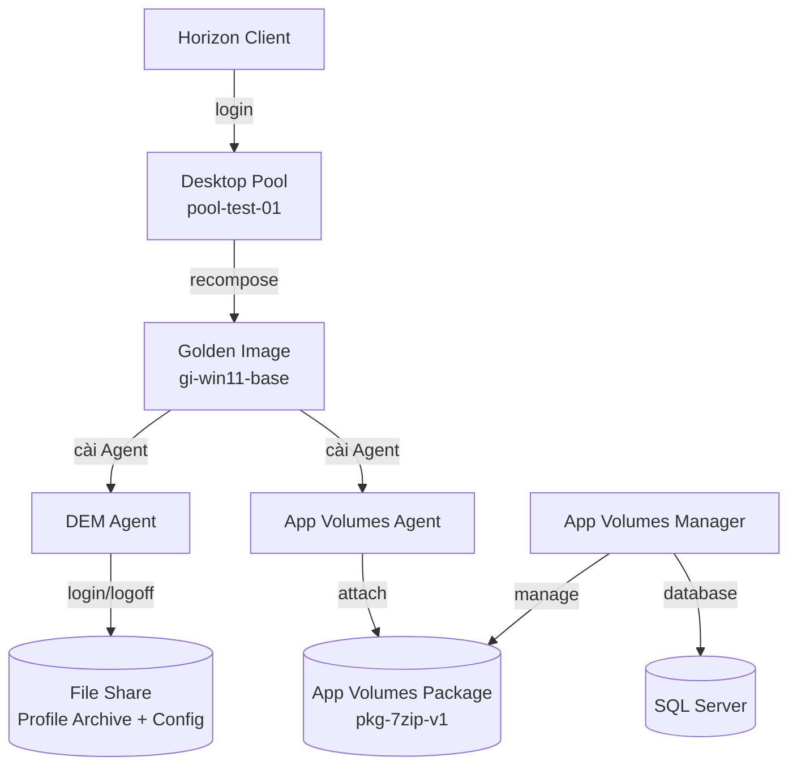

# User Environment Management (DEM & App Volumes)
- DEM tách profile/setting của user ra khỏi VM, App Volumes tách application ra khỏi golden image, cho phép desktop pool floating vẫn giữ được cá nhân hóa và app cần dùng dù VM bị xóa sau mỗi lần logoff. Xem lý thuyết đầy đủ tại [[horizon--user-environment-management]]
- Lab này nối tiếp Lab 2 và Lab 3, dùng golden image gi-win11-base và Desktop Pool pool-test-01 đã hoạt động để bổ sung khả năng cá nhân hóa và đóng gói ứng dụng động
- Kết thúc lab, user test sẽ giữ được setting cá nhân qua các lần login khác nhau, và nhận được một ứng dụng không nằm trong golden image thông qua App Volumes

# Prerequisites
- Lab 1, Lab 2, Lab 3 đã hoàn thành, Connection Server, Desktop Pool pool-test-01, và UAG đang hoạt động
- Golden image gi-win11-base từ Lab 2 vẫn còn truy cập được để cài thêm Agent
- Một file server hoặc file share hiện có, dùng làm nơi lưu Profile Archive và Configuration Share cho DEM
- Installer VMware Dynamic Environment Manager (Management Console và Agent) đã copy sẵn, đúng version tương thích Horizon Agent đang dùng
- Installer VMware App Volumes Manager và Agent đã copy sẵn
- SQL Server hoặc SQL Server Express đã cài đặt sẵn hoặc sẽ cài trong lab, dùng làm database backend cho App Volumes Manager
- Một VM Windows Server riêng hoặc dùng chung VM quản trị để cài App Volumes Manager
- Service account riêng cho App Volumes Manager có quyền tương tác với vCenter
- Một VM tạm dùng làm Packaging VM để capture cài đặt ứng dụng mẫu
- Security Group VDI-Users từ Lab 1 đã có ít nhất một user test

# Diagram

---
# Installation

### Chuẩn bị file share cho DEM

- Tạo folder riêng cho Profile Archive trên file server hiện có, ví dụ \\\\fileserver\\DEMProfiles
- Tạo folder riêng cho Configuration Share, ví dụ \\\\fileserver\\DEMConfig, tách biệt với Profile Archive
- Set NTFS và share permission cho group VDI-Users là Modify trên Profile Archive, Read trên Configuration Share
- Cấp Full Control cho service account quản trị DEM trên cả hai folder
- Bật Shadow Copies hoặc backup định kỳ cho Profile Archive nếu tổ chức cần khả năng restore profile

### Cài đặt DEM Management Console

- Copy installer VMware Dynamic Environment Manager vào Admin Workstation hoặc management VM
- Chạy installer, chọn cài đặt Management Console
- Trong quá trình cài, trỏ Console tới Configuration Share \\\\fileserver\\DEMConfig vừa tạo
- Sau khi cài xong, mở DEM Management Console, xác nhận Console đọc/ghi được vào Configuration Share

### Cấu hình DEM Personalization

- Trong DEM Management Console, tạo mới cấu hình Personalization, trỏ Profile Archive tới \\\\fileserver\\DEMProfiles
- Import Application Profile có sẵn cho các app phổ biến cần personalize như Windows Explorer, trình duyệt, bộ Office
- Cấu hình Personalization Triggers, xác định rõ setting nào được lưu lúc logoff và áp lại lúc login
- Cấu hình thêm Environment settings nếu tổ chức cần, ví dụ drive mapping hoặc printer mapping theo policy nội bộ

### Cài đặt DEM Agent lên golden image

- Mở lại golden image gi-win11-base từ Lab 2
- Copy installer DEM Agent vào golden image, chạy với quyền local Administrator
- Trong quá trình cài, trỏ Agent Configuration Path về Configuration Share \\\\fileserver\\DEMConfig
- Restart golden image sau khi cài xong, kiểm tra DEM Agent service đang chạy trong Services.msc

### Cài đặt App Volumes Manager

- Trên VM Windows Server dành riêng, cài đặt SQL Server Express nếu chưa có sẵn database backend
- Chạy installer App Volumes Manager, trỏ tới SQL instance vừa cài, để installer tự tạo database mới cho App Volumes
- Sau khi cài xong, truy cập App Volumes Manager qua web console
- Cấu hình kết nối tới vCenter Server, nhập service account riêng cho App Volumes
- Cấu hình Storage location cho App Volumes package, trỏ tới Datastore vSAN đã dùng ở các lab trước

### Tạo App Volumes Package

- Trong App Volumes Manager, tạo mới Package, chọn Packaging VM đã chuẩn bị làm máy capture
- Bắt đầu chế độ Capture trên Packaging VM
- Cài đặt ứng dụng mẫu như bình thường trên Packaging VM trong lúc đang Capture
- Kết thúc Capture, App Volumes Manager tự đóng gói ứng dụng vừa cài thành một VMDK Package
- Đặt tên Package rõ ràng kèm version, ví dụ pkg-7zip-v1, ghi chú ngày tạo

### Attach Package vào Desktop Pool

- Trong App Volumes Manager, tạo mới Assignment, gán Package pkg-7zip-v1 cho Security Group VDI-Users
- Cài đặt App Volumes Agent lên golden image gi-win11-base, tương tự cách cài DEM Agent
- Trong quá trình cài Agent, trỏ về địa chỉ App Volumes Manager vừa deploy
- Restart golden image sau khi cài Agent, kiểm tra App Volumes Agent service đang chạy

### Cập nhật golden image và recompose pool

- Sau khi golden image đã có cả DEM Agent và App Volumes Agent, dọn dẹp máy, xóa cache và log cài đặt
- Tạo snapshot mới cho golden image, đặt tên ví dụ Base-v2, ghi chú nội dung thay đổi so với Base-v1
- Trong Horizon Console, vào Desktop Pool pool-test-01, chọn chức năng cập nhật image, trỏ pool sang snapshot Base-v2, tham khảo cơ chế recompose tại [[horizon--desktop-pool-provisioning]]
- Theo dõi quá trình recompose trong Horizon Console, các Instant Clone cũ sẽ lần lượt được thay bằng bản dựng từ Base-v2

### Kiểm tra kết quả

- Đăng nhập user test vào pool-test-01 qua Horizon Client, xác nhận desktop nhận được là bản dựng từ Base-v2
- Xác nhận ứng dụng pkg-7zip-v1 xuất hiện sẵn trong Start Menu dù không được cài trực tiếp trong golden image
- Thay đổi một setting cá nhân hóa, ví dụ desktop wallpaper hoặc ghim ứng dụng vào taskbar, sau đó logoff
- Đăng nhập lại lần nữa, hoặc nhận một desktop khác nếu pool đang ở chế độ floating, xác nhận setting cá nhân hóa vừa đổi vẫn được giữ nguyên nhờ DEM
- Kiểm tra trên file share Profile Archive, xác nhận đã có file profile mới được tạo cho user test

Lab này hoàn tất chuỗi bốn lab core của hệ thống VDI cơ bản, từ storage và Active Directory, Connection Server, Desktop Pool, Unified Access Gateway, đến User Environment Management. Toàn bộ kiến trúc và các điểm cần mở rộng thêm cho production như HA, monitoring, capacity planning được tổng hợp lại tại root note [[VDI]]
