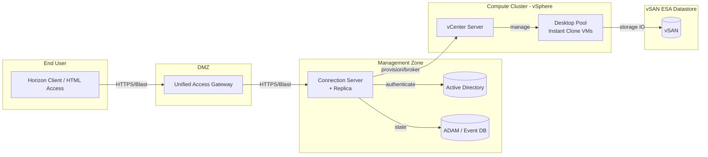

# VDI (Virtual Desktop Infrastructure) — VMware Horizon
Tags: #vdi #vmware #horizon #infra
Last updated: 2026-07-07

---

### **1. What — Nó là cái gì?**

VDI là mô hình chạy desktop OS (Windows/Linux) như một VM tập trung trong datacenter, user chỉ nhận hình ảnh màn hình (display protocol) qua client nhẹ. VMware Horizon là platform VDI của VMware, chạy trên nền vSphere, quản lý việc provision, kết nối, và broker session giữa user và virtual desktop.

### **2. Why — Tại sao tồn tại / Vấn đề nó giải quyết?**

Nếu không có VDI: data và OS nằm rải rác trên hàng trăm/nghìn laptop/PC — patch, backup, chống leak data, cấp quyền cho contractor/BYOD đều phải làm thủ công từng máy. VDI gom toàn bộ compute + data về datacenter (hoặc private cloud), user chỉ là "cửa sổ" nhìn vào. Điều này giải quyết: mất máy không mất data, patch 1 golden image thay vì 1000 máy, cấp/thu hồi quyền truy cập tức thì, và đáp ứng compliance (data không rời khỏi DC) — đặc biệt quan trọng với môi trường airgap/security-first như techstack hiện tại ([[vdi--networking-firewall-ports]]).

### **3. When — Dùng khi nào / KHÔNG dùng khi nào?**

Dùng khi: cần chuẩn hóa environment cho nhiều user (call center, contractor, dev/test lab), cần kiểm soát data residency chặt (finance, gov, airgap), user di chuyển nhiều nơi nhưng cần cùng 1 desktop.

KHÔNG dùng khi: user cần đồ họa nặng ổn định real-time mà network latency không đảm bảo (dùng workstation vật lý hoặc physical PC over remote thay vì VDI); site có ít user (<20-30) không đủ để amortize chi phí Connection Server + storage + license; ứng dụng cần hardware đặc thù (dongle, GPIO, thiết bị ngoại vi hiếm) khó pass-through; hoặc network WAN quá tệ (>150ms latency, jitter cao) làm trải nghiệm protocol tệ dù dùng Blast Extreme.

### **4. Where - Architecture — Nó nằm ở đâu trong hệ thống?**

Vị trí trong hệ thống: Horizon nằm phía trên vSphere/vSAN như 1 management layer chuyên biệt (giống vCenter quản lý VM thường, Horizon quản lý VM là desktop). Các component chính: Connection Server ([[horizon--connection-server]]), Unified Access Gateway ([[horizon--unified-access-gateway]]), vCenter + ESXi cluster, vSAN datastore ([[vdi--storage-vsan-sizing]]). Traffic/data flow: client → UAG (nếu remote) → Connection Server (auth + broker) → redirect session trực tiếp tới desktop VM. Dependency: AD/LDAP bắt buộc, vCenter bắt buộc, DNS/NTP chuẩn (Kerberos rất nhạy thời gian).

### **5. How — Cơ chế hoạt động**

Core concepts:
- **Broker model**: Connection Server không proxy toàn bộ traffic, nó chỉ authenticate và "giới thiệu" client kết nối thẳng tới desktop qua display protocol — giảm tải cho CS. Chi tiết: [[horizon--connection-server]]
- **Provisioning**: Desktop được tạo hàng loạt từ 1 golden image bằng Instant Clone (VMFork), không phải cài tay từng máy. Chi tiết: [[horizon--desktop-pool-provisioning]]
- **Display protocol**: Blast Extreme là protocol mặc định hiện tại, thay thế PCoIP cũ. Chi tiết: [[horizon--display-protocol]]
- **User Environment Management (UEM)**: tách profile/setting/app ra khỏi VM để VM có thể là stateless (instant clone xóa sau logoff mà user không mất gì). Chi tiết: [[horizon--user-environment-management]]
- **Edge access**: UAG là reverse-proxy chuyên dụng đứng ở DMZ, không cần VPN client để truy cập từ ngoài. Chi tiết: [[horizon--unified-access-gateway]]

Request lifecycle (login flow): user mở Horizon Client → connect tới UAG (external) hoặc CS (internal) → nhập credential → CS xác thực với AD → CS check entitlement (user có được gán pool nào) → CS chọn 1 desktop free trong pool, power-on nếu cần → CS trả về "ticket" kết nối trực tiếp desktop qua Blast Extreme → client disconnect khỏi CS, kết nối thẳng desktop.

### **6. Key Config — Cấu hình cần nhớ**

- Số lượng Connection Server tối thiểu cho HA: 2 (1 primary group), không cần load balancer nếu chỉ test nhưng production bắt buộc có LB phía trước group CS.
- Pool type mặc định nên chọn Instant Clone (không phải Linked Clone — đã deprecated từ Horizon 8).
- Protocol mặc định nên set Blast Extreme, không PCoIP (PCoIP đang bị phase out).
- Timeout mặc định của session (disconnect timeout) hay bị để "Never" — nguy hiểm về security, nên set về vài giờ.

### **7. Security Considerations**

- Attack surface: UAG ở DMZ là điểm expose ra ngoài nhiều nhất — phải patch thường xuyên, chỉ mở port cần thiết ([[vdi--networking-firewall-ports]]).
- Misconfiguration nguy hiểm nhất: để Connection Server tiếp xúc trực tiếp Internet thay vì qua UAG; tắt SSL giữa CS-UAG; dùng shared local admin password trên golden image.
- Hardening checklist tối thiểu: MFA cho CS (RADIUS/SAML), UAG luôn ở DMZ riêng VLAN, disable USB redirect/clipboard/printer redirect nếu không cần (giảm data exfiltration path), enable FIPS mode nếu compliance yêu cầu, patch golden image trước khi recompose pool.

### **8. Ops Runbook — Production Notes**

- Health check: Horizon Console → Dashboard, check status từng CS, UAG, datastore usage, pool status (available/provisioning/error).
- Log quan trọng: `debug-*.log` trên Connection Server (`C:\ProgramData\VMware\VDM\logs`), Event Database (login failures, session errors).
- Metric cần alert: số desktop "available" trong pool xuống thấp, CS CPU/memory cao, vSAN latency/congestion ([[vdi--storage-vsan-sizing]]).
- Restart/rollback: recompose pool để rollback golden image lỗi; restart Horizon service qua service `VMware Horizon Connection Server` chứ không reboot cả VM nếu không cần.

### **9. Gotchas & Lessons Learned**

- Instant Clone yêu cầu golden image phải ở dạng snapshot cụ thể, quên snapshot mới là recompose fail.
- Airgap environment: Horizon cần validate license/subscription — phải kiểm tra kỹ cơ chế license offline/subscription trước khi triển khai (xem [[vdi--capacity-planning-licensing]]).
- Clock skew giữa CS và AD làm Kerberos fail âm thầm — luôn kiểm tra NTP trước khi debug auth issue khác.

### **10. Resources**

- Official docs: VMware Horizon 8 Documentation (docs.vmware.com/en/VMware-Horizon)
- VMware Horizon Reference Architecture (Tech Zone / techzone.vmware.com)
- vSAN Design and Sizing Guide cho VDI workload
