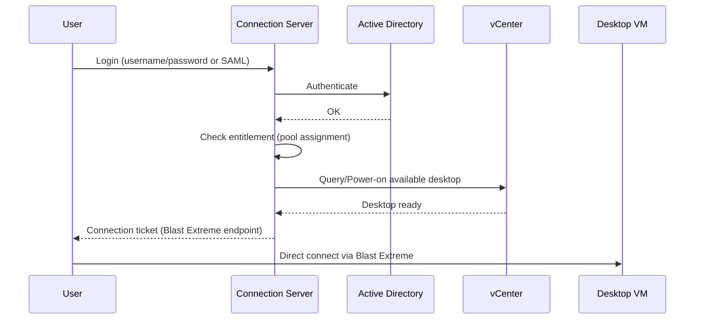

# Horizon — Connection Server
Tier: 2
Parent: [[VDI]]
Related: [[horizon--unified-access-gateway]], [[horizon--desktop-pool-provisioning]], [[vdi--networking-firewall-ports]]
Tags: #horizon #broker #ha

## What it does

Connection Server (CS) là broker: xác thực user với AD, kiểm tra entitlement (user được gán pool nào), chọn desktop VM còn trống trong pool, rồi trả về ticket để client kết nối trực tiếp tới desktop. CS không proxy hình ảnh desktop qua nó (trừ khi dùng HTML Access/tunnel mode) — nó chỉ "môi giới" phiên kết nối.

## Why it exists

Nếu không có broker, admin phải gán tay từng user vào từng desktop VM cụ thể và user phải tự biết IP desktop nào để connect — không thể scale, không thể pooling resource, không load-balance được. CS tách logic "ai được dùng gì" ra khỏi hạ tầng compute, cho phép pool desktop dùng chung và cấp phát động.

## How it works (flow/diagram)

Triển khai theo group tối thiểu 2 node (1 group, không có khái niệm "primary/secondary" như cũ — Horizon 8 dùng shared ADAM database replicate giữa các node, mọi CS trong group đều active). Load balancer (F5, NSX ALB, hoặc UAG) đứng trước group để phân tải và làm HA endpoint.

## Config gotchas

- Group CS chia sẻ database ADAM (LDAP-based) — replicate tự động, nhưng nếu network giữa các CS bị đứt lâu sẽ gây split-brain nhẹ, cần join lại group thủ công.
- Session timeout / disconnect timeout mặc định "Never" — phải set lại theo policy công ty.
- Cần trỏ đúng SSL certificate hợp lệ (không self-signed) cho production, nếu không Horizon Client sẽ cảnh báo hoặc từ chối kết nối tùy cấu hình.
- Đổi FQDN sau khi cài rất phức tạp (liên quan certificate, DNS, entitlement) — chốt FQDN chuẩn trước khi cài.

## Security notes

- Không expose CS trực tiếp ra Internet — luôn đặt [[horizon--unified-access-gateway]] ở DMZ phía trước.
- Bật MFA (RADIUS/SAML/SecurID) ở CS cho truy cập từ ngoài.
- Giới hạn số lần login sai (account lockout policy) để chống brute-force qua CS.
- Log event login/logout đẩy về SIEM qua Event Database — quan trọng cho audit trail trong môi trường compliance.

## Refs

- VMware Horizon Connection Server Administration Guide (docs.vmware.com)
- VMware Horizon Architecture Overview (Tech Zone)
