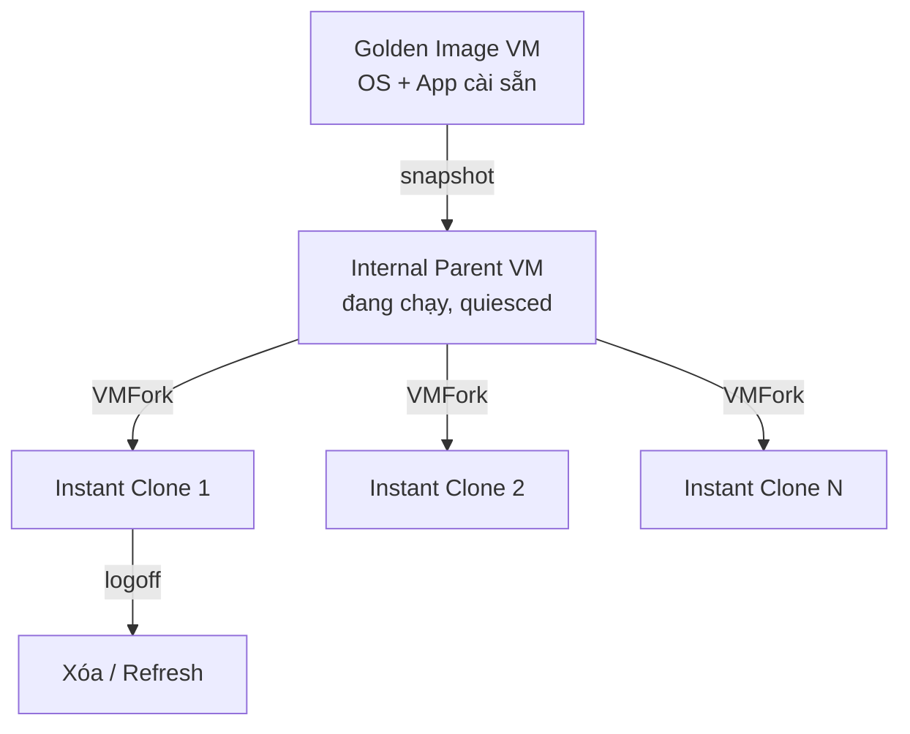

# Horizon — Desktop Pool Provisioning
Tier: 2
Parent: [[VDI]]
Related: [[horizon--connection-server]], [[horizon--user-environment-management]], [[vdi--storage-vsan-sizing]]
Tags: #horizon #provisioning #instant-clone

## What it does

Cơ chế Horizon tạo hàng loạt desktop VM từ 1 "golden image" (VM mẫu đã cài OS + app + config chuẩn) thay vì cài tay từng máy. Có 3 kiểu clone: Full Clone (VM độc lập hoàn toàn), Linked Clone (dùng Composer, đã deprecated từ Horizon 8), và Instant Clone (dùng VMFork, là chuẩn hiện tại).

## Why it exists

Nếu không có provisioning tự động, thêm 500 user đồng nghĩa cài tay 500 VM Windows — không thể patch đồng bộ, không thể đảm bảo config giống nhau, không scale được. Instant Clone giải quyết bài toán "tạo desktop mới trong vài giây, disposable, luôn đúng golden image mới nhất" bằng cách fork trực tiếp từ 1 VM cha đang chạy (parent VM) ở memory/disk level, không cần full boot OS.

## How it works (flow/diagram)

Quy trình chuẩn: build golden image (cài OS, join domain hoặc dùng QuickPrep/Instant Clone domain join, cài Horizon Agent, cài app cần thiết) → tối ưu image (disable service không cần, optimization tool của VMware OS Optimization Tool) → tạo snapshot → tạo Desktop Pool trỏ vào snapshot đó → Horizon tự tạo internal "parent VM" và fork ra số lượng instant clone theo pool size. Khi cần update: chỉnh sửa golden image, tạo snapshot mới, "push image" / recompose pool để thay toàn bộ clone bằng bản mới.

Pool có 2 mô hình gán user: **Dedicated** (user cố định 1 desktop, giữ state qua các lần login — floating hoặc dedicated assignment) và **Floating** (user vào desktop bất kỳ còn trống, dùng xong thường bị xóa/refresh — phù hợp mô hình stateless kết hợp [[horizon--user-environment-management]]).

## Config gotchas

- Instant Clone yêu cầu golden image ở đúng snapshot đã chọn khi tạo pool — sửa VM gốc mà quên tạo snapshot mới thì recompose sẽ không nhận thay đổi.
- Golden image phải cài Horizon Agent đúng version tương thích với Connection Server, lệch version gây agent không register.
- Sizing pool phải tính cả compute lẫn storage IOPS lúc "boot storm" (nhiều máy power-on cùng lúc giờ hành chính) — xem [[vdi--storage-vsan-sizing]].
- Floating pool dùng chung app data cần kết hợp UEM tool ([[horizon--user-environment-management]]) nếu không user sẽ mất hết cá nhân hóa mỗi lần logoff.

## Security notes

- Golden image là nơi duy nhất cần hardening kỹ (CIS benchmark, patch OS, xóa credential/cache) — vì mọi lỗ hổng trong đó sẽ nhân bản ra toàn bộ pool.
- Không để local admin account chung password mặc định trên golden image.
- Floating/stateless pool giảm rủi ro data tồn dư vì VM bị xóa sau mỗi session — phù hợp môi trường cần data không lưu lại trên desktop.
- Instant Clone dùng chung memory page với parent VM (VMFork) — cần hiểu rủi ro side-channel lý thuyết nếu multi-tenant chung host, dù thực tế Horizon đã cô lập ở mức VM.

## Refs

- VMware Horizon Instant Clone Technology (Tech Zone)
- VMware OS Optimization Tool (Fling/officialtool)
- Horizon Console — Desktop Pools Administration Guide
