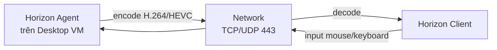

# Horizon — Display Protocol (Blast Extreme / PCoIP / RDP)
Tier: 2
Parent: [[VDI]]
Related: [[horizon--connection-server]], [[horizon--unified-access-gateway]]
Tags: #horizon #protocol #network

## What it does

Display protocol là cơ chế mã hóa hình ảnh/âm thanh/input từ desktop VM trong datacenter, nén và truyền qua network tới client. Horizon hỗ trợ 3 protocol: Blast Extreme (mặc định, chuẩn hiện tại), PCoIP (protocol cũ, đang bị phase out), và Microsoft RDP (dự phòng, ít dùng vì thiếu tối ưu multimedia).

## Why it exists

Nếu không có display protocol tối ưu, VDI sẽ trải nghiệm tệ hơn remote desktop thông thường (RDP thô) — giật hình khi video call, lag chuột trên WAN, không tận dụng được hardware encode của GPU. Blast Extreme được thiết kế để chạy tốt trên network không ổn định (mobile network, WAN), hỗ trợ TCP lẫn UDP, và tận dụng H.264/HEVC hardware encode khi có GPU.

## How it works (flow/diagram)

Blast Extreme tự động chọn TCP hoặc UDP tùy điều kiện network (UDP ưu tiên vì latency thấp hơn, tự fallback TCP nếu UDP bị chặn firewall). Có thể tận dụng GPU pass-through/vGPU trên ESXi để hardware-encode, giảm tải CPU của desktop VM và cải thiện độ trễ.

## Config gotchas

- UDP thường bị chặn ở firewall doanh nghiệp mặc định — nếu không mở đúng port, Blast tự rơi về TCP, hoạt động vẫn được nhưng chất lượng thấp hơn (xem [[vdi--networking-firewall-ports]]).
- PCoIP vẫn tồn tại trong môi trường legacy nhưng không nên chọn cho deployment mới — VMware đang giảm dần đầu tư vào PCoIP.
- Cấu hình codec (H.264 vs HEVC) ảnh hưởng tải CPU/GPU của desktop VM lẫn băng thông — cần test thực tế trước khi áp dụng toàn pool.
- HTML Access (qua browser, không cần cài Horizon Client) dùng protocol riêng dựa trên Blast qua WebSocket, tiện cho truy cập nhanh nhưng tính năng (audio, USB redirect) bị giới hạn hơn client native.

## Security notes

- Toàn bộ traffic Blast Extreme nên mã hóa TLS/DTLS, không nên tắt encryption dù trong LAN nội bộ.
- Feature redirect (clipboard, USB, printer, drive) đi kèm protocol là điểm exfiltration data cần cân nhắc tắt/bật theo policy — đây là control quan trọng cho môi trường cần kiểm soát data chặt.
- Nên giới hạn port range UDP mở ra ngoài chỉ đúng dải Horizon cần, không mở rộng toàn bộ range.

## Refs

- VMware Blast Extreme Display Protocol (Tech Zone deep-dive)
- Horizon Client/Agent — Feature/Protocol Support Matrix
