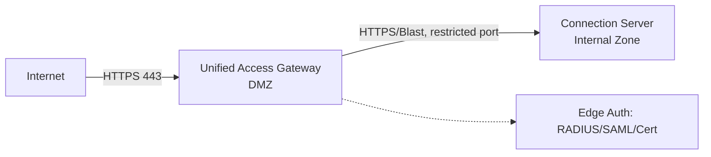

# Horizon — Unified Access Gateway (UAG)
Tier: 2
Parent: [[VDI]]
Related: [[horizon--connection-server]], [[vdi--networking-firewall-ports]]
Tags: #horizon #dmz #edge

## What it does

UAG là appliance (virtual appliance riêng, không chung OS với Windows CS) đứng ở DMZ, đóng vai trò reverse-proxy/gateway cho user truy cập Horizon từ ngoài mạng nội bộ (Internet, remote site) mà không cần VPN client. UAG terminate TLS, forward traffic đã xác thực vào Connection Server phía trong.

## Why it exists

Nếu không có UAG, muốn cho user remote truy cập desktop thì phải mở VPN full-tunnel (attack surface lớn hơn, quản lý client VPN phức tạp) hoặc tệ hơn là expose thẳng Connection Server ra Internet (rủi ro rất cao vì CS chạy trên Windows, join domain, là mục tiêu tấn công giá trị cao). UAG là 1 hardened Linux appliance chuyên biệt, không join domain, giảm blast radius nếu bị compromise.

## How it works (flow/diagram)

UAG có thể làm edge authentication (nhận MFA ngay tại DMZ trước khi traffic vào tới CS), đóng vai trò Secure Gateway cho cả Blast Extreme lẫn PCoIP, và có thể publish thêm reverse-proxy cho web app khác (không chỉ Horizon).

## Config gotchas

- UAG deploy dạng OVA riêng biệt, không patch chung quy trình với Windows CS — cần theo dõi version release riêng.
- Certificate ở UAG phải là cert public/hợp lệ (không self-signed) nếu expose ra Internet, khác với cert nội bộ ở CS.
- Cấu hình sai balance giữa "Edge Service Settings" (Blast/PCoIP/Tunnel) dễ khiến 1 protocol hoạt động nhưng protocol khác fail im lặng.
- Trong môi trường airgap có proxy giới hạn Internet ([[vdi--networking-firewall-ports]]), UAG vẫn cần đường ra ngoài (hoặc load balancer public) để nhận traffic client — cần thiết kế network zone riêng cho việc này.

## Security notes

- Luôn đặt UAG trong VLAN DMZ riêng, tách biệt hoàn toàn với management zone và compute zone.
- Chỉ mở đúng port cần thiết từ Internet vào UAG (thường 443 TCP/UDP cho Blast), và chỉ mở port hẹp từ UAG vào CS phía trong — không mở toàn bộ range.
- Bật edge authentication (MFA) tại UAG để chặn brute-force trước khi chạm tới CS.
- Không nên cho UAG join domain — giữ đúng nguyên tắc "DMZ appliance không có credential domain".

## Refs

- VMware Unified Access Gateway Deploying and Configuring Guide (docs.vmware.com)
- VMware Horizon Security Guide — Edge Services section
