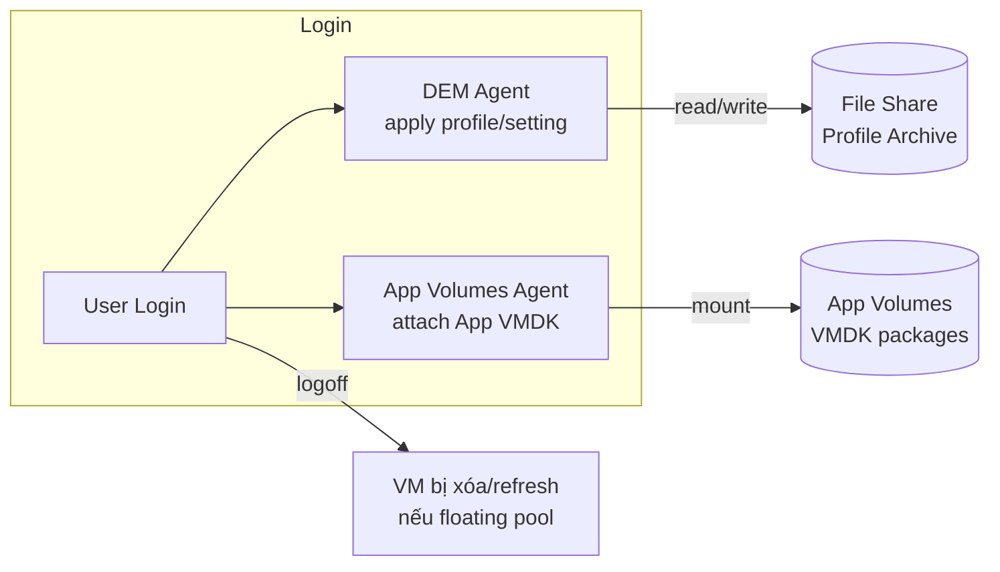

# Horizon — User Environment Management (DEM & App Volumes)
Tier: 2
Parent: [[VDI]]
Related: [[horizon--desktop-pool-provisioning]]
Tags: #horizon #uem #profile

## What it does

Nhóm tool tách 3 lớp: **user profile/setting** (Dynamic Environment Manager - DEM), **application** (App Volumes), ra khỏi VM desktop — để desktop VM có thể là stateless/disposable (Instant Clone floating pool) mà user vẫn giữ được cá nhân hóa và app cần dùng.

## Why it exists

Nếu desktop là stateless hoàn toàn (bị xóa sau mỗi lần logoff) mà không có UEM, user sẽ mất hết setting, wallpaper, app đã cài mỗi lần login lại — trải nghiệm tệ hơn cả PC vật lý. UEM giải quyết bằng cách lưu profile/setting ở network share riêng (áp vào VM lúc login, gỡ ra lúc logoff) và "attach" application dưới dạng virtual disk (VMDK) thay vì cài cứng vào golden image — cho phép golden image gọn nhẹ, ít phải recompose khi chỉ cần update 1 app.

## How it works (flow/diagram)

DEM hoạt động dựa trên config file (`.ini`) định nghĩa app nào cần personalize setting gì, áp dụng lúc login/logoff mà không cần roaming profile truyền thống của Windows (vốn nặng và dễ conflict). App Volumes đóng gói application thành 1 VMDK (gọi là "Package" hoặc "AppStack"), attach vào VM lúc login như 1 ổ đĩa ảo — app xuất hiện như đã cài sẵn nhưng thực chất không nằm trong golden image.

## Config gotchas

- Profile archive lưu trên file share (SMB) — cần tính HA/backup riêng cho share này, nếu share down thì toàn bộ user login sẽ mất personalization hoặc lỗi.
- App Volumes cần build package đúng cách (cài app vào 1 VM tạm dành riêng để capture), sai quy trình dễ gây conflict DLL giữa các package.
- Kích thước profile archive tăng dần theo thời gian nếu không có policy dọn cache — cần set quota hoặc rule loại trừ file lớn (ISO, video cá nhân).
- Version DEM/App Volumes cần tương thích với Horizon Agent version trên golden image.

## Security notes

- File share chứa profile là nơi tập trung data nhạy cảm của toàn bộ user — cần ACL chặt và mã hóa at-rest.
- App Volumes cho phép attach app theo AD group — dùng đúng group scope để tránh user thấy/dùng được app không được cấp quyền.
- Vì golden image gọn (ít app cài cứng), attack surface trên mỗi VM giảm — đây là lợi ích bảo mật phụ của kiến trúc này.

## Refs

- VMware Dynamic Environment Manager Administration Guide
- VMware App Volumes Administration Guide
- Horizon Reference Architecture — Profile & App Layering section
