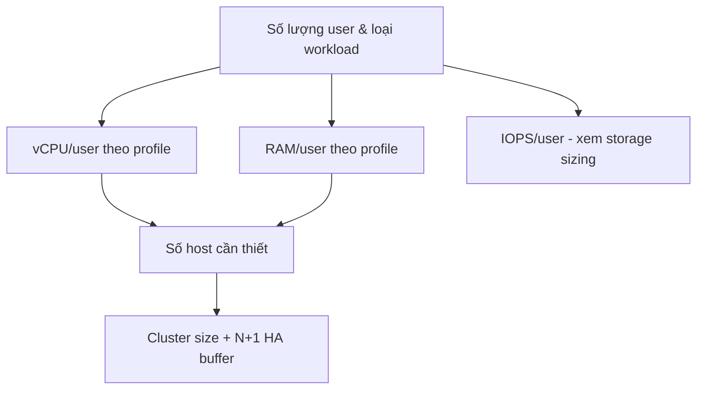

# VDI — Capacity Planning và Licensing (Horizon)
Tier: 2
Parent: [[VDI]]
Related: [[vdi--storage-vsan-sizing]], [[horizon--desktop-pool-provisioning]]
Tags: #vdi #sizing #licensing

## What it does

Ước lượng số lượng host/cluster cần thiết dựa trên số user và loại workload (task worker/knowledge worker/power user), và hiểu mô hình license của VMware Horizon để mua đúng loại, đúng số lượng.

## Why it exists

Sizing sai theo 2 hướng đều tốn kém: sizing thiếu gây nghẽn performance giờ cao điểm (trải nghiệm user tệ, dự án bị đánh giá thất bại), sizing thừa gây lãng phí license/hardware đáng kể vì VDI thường mua theo quy mô lớn (hàng trăm/nghìn user). License Horizon cũng dễ nhầm giữa các gói (Standard/Advanced/Enterprise, nay gộp vào Horizon Universal Subscription) dẫn đến thiếu tính năng cần dùng (ví dụ mua gói thấp không có App Volumes/DEM).

## How it works (flow/diagram)

Công thức tham khảo (cần benchmark lại theo tải thực tế của tổ chức): Task worker (~2 vCPU, 2-4GB RAM, ít IOPS) — ví dụ data entry, call center; Knowledge worker (~2-4 vCPU, 4-8GB RAM, IOPS trung bình) — ví dụ nhân viên văn phòng; Power user (~4+ vCPU, 8-16GB+ RAM, IOPS cao) — ví dụ dev, thiết kế đồ họa nhẹ. Từ đó tính consolidation ratio (số desktop/host) dựa trên vCPU:pCPU ratio thực tế của tổ chức (không nên áp dụng con số của vendor mà không test), rồi cộng thêm N+1 (hoặc N+2) host dự phòng cho HA và bảo trì.

License Horizon hiện tại bán theo Horizon Universal Subscription (theo Named User hoặc Concurrent Connection User - CCU), bao gồm quyền dùng on-prem, cloud, hoặc hybrid tùy edition. Cần xác nhận rõ: subscription có yêu cầu "phone home" định kỳ để validate hay không — quan trọng nếu triển khai airgap, vì có thể cần cấu hình license server offline hoặc kênh activation riêng qua proxy giới hạn.

## Config gotchas

- Đừng dùng benchmark IOPS/vCPU chung chung từ tài liệu vendor mà không đo thử tải thực tế (chạy pilot pool nhỏ trước khi rollout toàn bộ).
- Named User license và CCU license tính khác nhau — tổ chức có nhiều user làm ca (shift, không đồng thời online) nên cân nhắc CCU để tiết kiệm.
- License activation cần đường mạng ra ngoài (qua proxy) định kỳ — cần làm rõ tần suất và endpoint cụ thể trước khi thiết kế firewall rule ([[vdi--networking-firewall-ports]]).

## Security notes

- Không nên tắt hẳn license validation traffic để "cho dễ" trong airgap — cần làm việc với VMware để có giải pháp offline license chính thức (ví dụ license file/token thay vì always-online), tránh vi phạm compliance license.

## Refs

- VMware Horizon Sizing and Consolidated Guidance (Tech Zone)
- VMware Horizon Licensing Guide / Horizon Universal Subscription datasheet
- VMware Horizon Pilot-to-Production Best Practices
