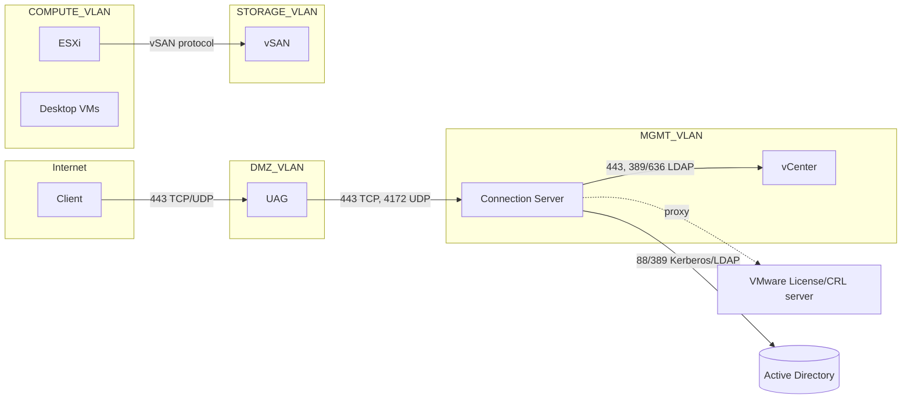

# VDI — Networking, Firewall Ports và Proxy trong môi trường Airgap
Tier: 2
Parent: [[VDI]]
Related: [[horizon--connection-server]], [[horizon--unified-access-gateway]], [[horizon--display-protocol]]
Tags: #vdi #network #firewall #airgap

## What it does

Định nghĩa network zone (segmentation) và port cần mở giữa các zone để hệ thống Horizon hoạt động, cùng cách xử lý việc Connection Server/UAG cần license activation hoặc update trong khi Internet bị giới hạn qua proxy.

## Why it exists

VDI kéo traffic qua nhiều lớp (client → DMZ → management → compute → storage), mỗi lớp cần đúng port, thiếu 1 port có thể làm cả chuỗi fail nhưng lỗi hiển thị mơ hồ (ví dụ: login được nhưng desktop đen màn hình vì UDP protocol port bị chặn). Trong môi trường airgap có proxy giới hạn, cần biết rõ thành phần nào thực sự cần ra Internet (activation, NTP, DNS) để không mở proxy tràn lan làm tăng attack surface, đồng thời không thiếu để tránh service fail âm thầm.

## How it works (flow/diagram)

Zone tách biệt tối thiểu: DMZ (chỉ chứa UAG), Management (CS, vCenter, AD nếu on-prem), Compute (ESXi host chạy desktop), Storage (vSAN, thường là network riêng/VLAN riêng cho vSAN traffic vì nhạy latency). Proxy trong môi trường airgap chỉ nên phục vụ các use case: kiểm tra license/subscription, tải certificate revocation list (CRL/OCSP), NTP nếu dùng public time server, và patch/update definition (nếu không có internal repo).

## Config gotchas

- Port hay bị quên: 4172 (UDP, PCoIP nếu còn dùng), UDP cho Blast Extreme (mặc định dùng chung 443 nhưng cần đảm bảo UDP không bị chặn để tránh fallback TCP làm giảm chất lượng) — xem [[horizon--display-protocol]].
- vSAN traffic (thường dùng riêng VLAN/vmkernel interface) tuyệt đối không đi qua proxy hay chung network với client traffic — sizing/latency vSAN rất nhạy.
- Kerberos (port 88) nhạy cảm với NTP sai giờ — clock skew giữa CS/ESXi/AD gây auth fail khó debug nếu không kiểm tra NTP trước.
- Proxy authentication (nếu proxy yêu cầu user/pass) cần cấu hình đúng ở từng service riêng (CS, ESXi, vCenter) — không phải service nào cũng đọc chung 1 file cấu hình proxy hệ thống.

## Security notes

- Nguyên tắc zone: chỉ UAG được chạm Internet trực tiếp, mọi thứ phía trong chỉ giao tiếp qua UAG hoặc qua proxy được kiểm soát chặt (allowlist domain, không phải allow-all).
- Firewall giữa các zone nên whitelist theo IP + port cụ thể, không dùng rule "allow subnet to subnet".
- Log traffic bị block ở firewall để phát hiện sớm port thiếu (thay vì chờ user report lỗi).

## Refs

- VMware Horizon Network Ports Documentation (docs.vmware.com — Ports and Protocols)
- VMware Horizon Security Guide — Network Segmentation
- vSAN Network Design Guide
