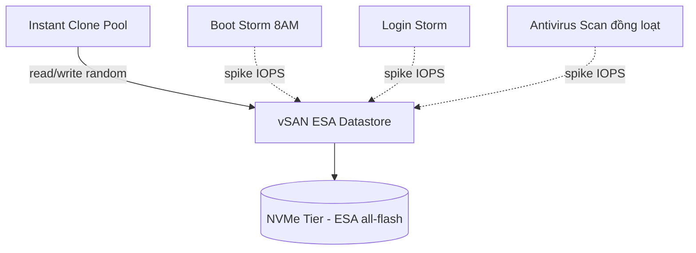

# VDI — Storage Design trên vSAN ESA
Tier: 2
Parent: [[VDI]]
Related: [[horizon--desktop-pool-provisioning]], [[vdi--capacity-planning-licensing]]
Tags: #vdi #vsan #storage #sizing

## What it does

Thiết kế và sizing storage backend (vSAN ESA) để chịu tải I/O đặc thù của VDI: nhiều VM nhỏ cùng đọc/ghi random, đặc biệt tại các thời điểm cao điểm (boot storm, login storm, antivirus scan đồng loạt).

## Why it exists

VDI có I/O pattern khác hẳn server workload thông thường: hàng trăm desktop VM cùng power-on lúc 8h sáng (boot storm) hoặc cùng login lúc bắt đầu ca làm (login storm) tạo ra spike IOPS cực lớn trong thời gian ngắn. Nếu sizing storage theo kiểu "trung bình" mà không tính spike, hệ thống sẽ nghẽn giờ cao điểm dù bình thường vẫn nhàn rỗi — đây là nguyên nhân phổ biến nhất khiến dự án VDI thất bại về performance.

## How it works (flow/diagram)

vSAN ESA (Express Storage Architecture, giới thiệu từ vSAN 8) dùng kiến trúc log-structured file system all-flash, không còn tách cache tier/capacity tier như OSA (Original Storage Architecture) cũ — toàn bộ dùng NVMe hiệu năng cao, giúp giảm write amplification, phù hợp hơn cho tải VDI vốn nhiều random write nhỏ. Sizing thực tế cần ước lượng: IOPS/desktop lúc bình thường (~5-10 IOPS/desktop knowledge worker), hệ số nhân lúc boot/login storm (có thể gấp 10-20 lần), và dung lượng theo loại pool (Instant Clone tiết kiệm hơn Full Clone vì share base disk).

## Config gotchas

- Đừng sizing storage chỉ theo dung lượng (GB) — bottleneck thực tế của VDI luôn là IOPS và latency, không phải capacity.
- vSAN ESA yêu cầu tối thiểu 3 node cho cluster tiêu chuẩn (RAID-1) hoặc 4+ node nếu muốn RAID-5/6 (erasure coding) để tiết kiệm dung lượng mà vẫn có fault tolerance.
- Nên stagger (so le) giờ boot/patch của các pool khác nhau để tránh boot storm cộng dồn toàn cluster.
- Cần networking đủ băng thông (25GbE khuyến nghị cho ESA) giữa các node vì ESA nhạy với network latency hơn OSA.

## Security notes

- Bật vSAN encryption at-rest nếu golden image chứa data nhạy cảm — quan trọng với môi trường compliance/airgap.
- Fault domain nên chia theo rack/power source thực tế, không chỉ chia logic, để tránh single point of failure vật lý.

## Refs

- vSAN ESA Design and Sizing Guide (VMware)
- VMware Horizon on vSAN Reference Architecture (Tech Zone)
- vSAN ESA vs OSA — Architecture Comparison whitepaper
